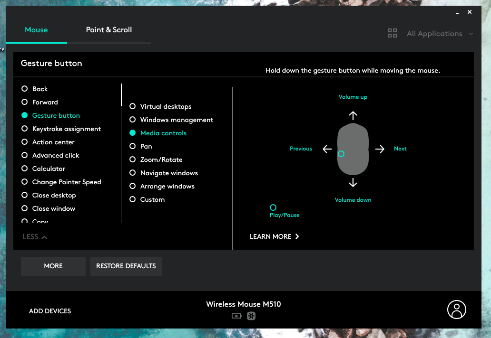

# MouseMediaGestures
### AutoHotKey script that maps mouse side buttons with gesture controls to allow for better media playback control.

Logitech has software called Logitech Options that allows you to map media controls to mouse buttons with gestures (but it only works with supported Logitech mice). I like the default configuration for media controls, which can be seen in the screenshot below.

I wanted some way to emulate this functionality on non-Logitech brand mice, so I created this AutoHotKey script to capture and remap mouse input for any mouse.

## Usage
Download and Install - [AutoHotKey](https://www.autohotkey.com/)
Download [MouseMediaGestures.ahk](MouseMediaGestures.ahk) file
  - Save to Windows Startup folder
